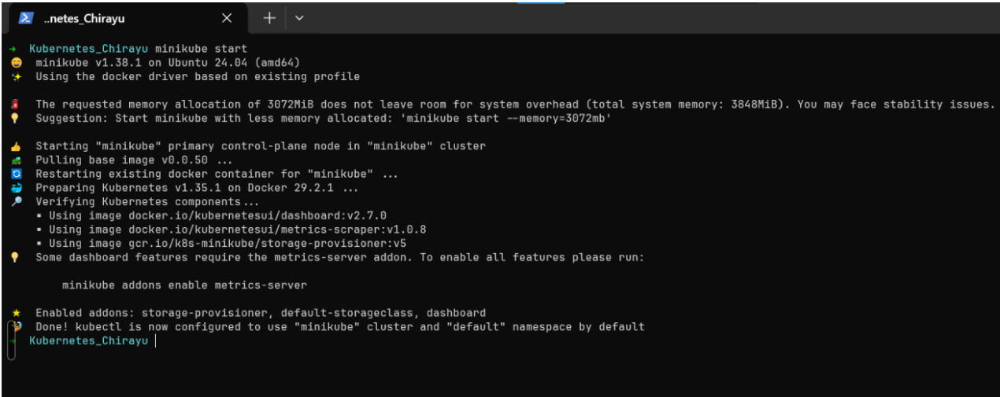
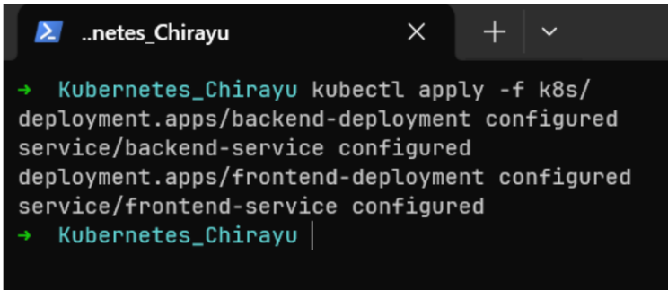
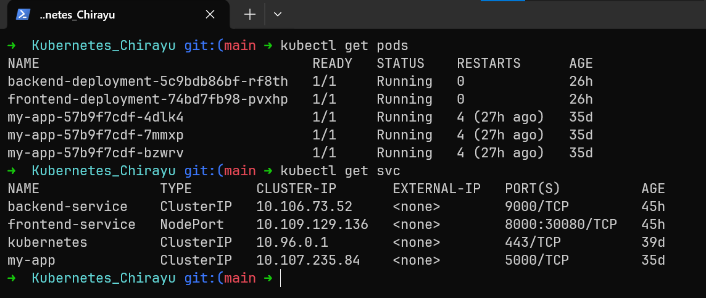
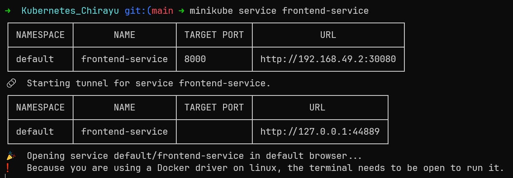
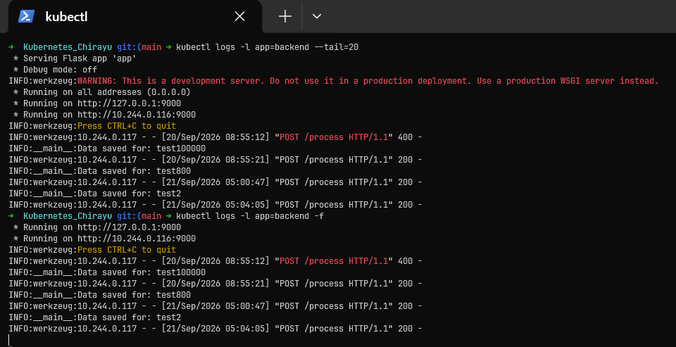
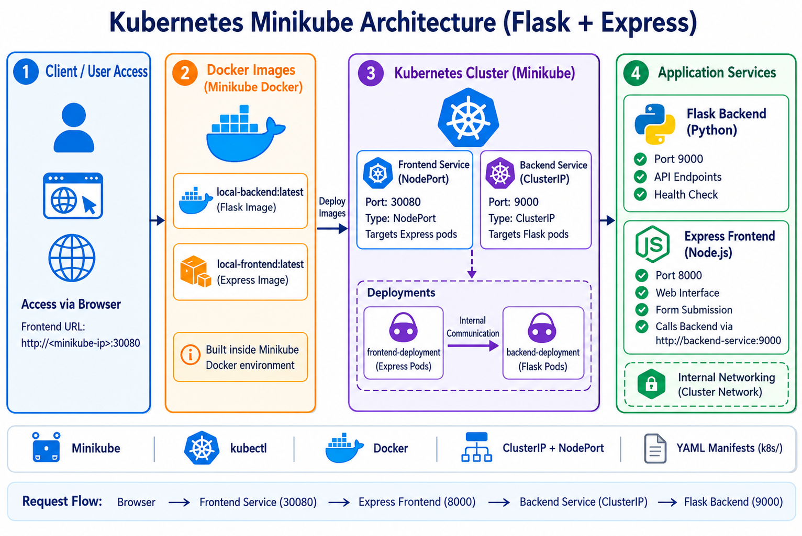

# Full-Stack Deployment on Kubernetes (Minikube)

````markdown
# Full-Stack Deployment on Kubernetes (Minikube)

## This project shows how to deploy a Flask backend and Express frontend application on a local Kubernetes cluster using Minikube.

## 📌 Architecture & Port Mapping

- **Backend:** Flask application running on port `9000`.
- **Backend Service:** `ClusterIP` service named `backend-service`.
- **Frontend:** Express application running on port `8000`.
- **Frontend Service:** `NodePort` service named `frontend-service` on port `30080`.

---

## 🚀 Deployment Steps

### 1. Start Minikube

First, I started the Minikube cluster.

```bash
minikube start
```
````


**Output:** Minikube started successfully and the local Kubernetes cluster became ready.

---

### 2. Connect Docker to Minikube

I connected the Docker CLI to the Docker environment used by Minikube.

```bash
eval $(minikube docker-env)
```

---

### 3. Build Docker Images

I built the backend and frontend images inside the Minikube Docker environment.

```bash
docker build -t local-backend:latest ./backend
docker build -t local-frontend:latest ./frontend
```

## **Output:** Both Docker images were created successfully.

### 4. Deploy Kubernetes Manifests

I applied all Kubernetes YAML files from the `k8s` folder.

```bash
kubectl apply -f k8s/
```


**Output:** Kubernetes deployments and services were created successfully.

---

### 5. Check Pods and Services

I checked the running pods and Kubernetes services.

```bash
kubectl get pods
kubectl get svc
```


**Output:** The backend and frontend pods are in `Running` state and the services are active.

---

### 6. Access the Frontend Application

I opened the frontend service using Minikube.

```bash
minikube service frontend-service
```


**Output:** The frontend application opened successfully in the browser.

````markdown
### Evidence 1: Backend Pods Live Logs (Best Visual Proof)

When you perform any action on the frontend (like form submit or page refresh), the Express frontend sends a request to the Flask backend. You can clearly see this HTTP request in the backend pod logs.

Run this command to check the logs:

```bash
kubectl logs -l app=backend --tail=20
```
````

For live logs, use:

```bash
kubectl logs -l app=backend -f
```

**Output:** You will see `HTTP/1.1 200 OK` or Flask server messages, which confirms that the backend is active and receiving requests.



````

---


## 📸 Architecture / Flow

The application flow is:

```text
Browser
   |
   v
Frontend Service (NodePort: 30080)
   |
   v
Express Frontend (Port 8000)
   |
   v
Backend Service (ClusterIP)
   |
   v
Flask Backend (Port 9000)
````



```

```
